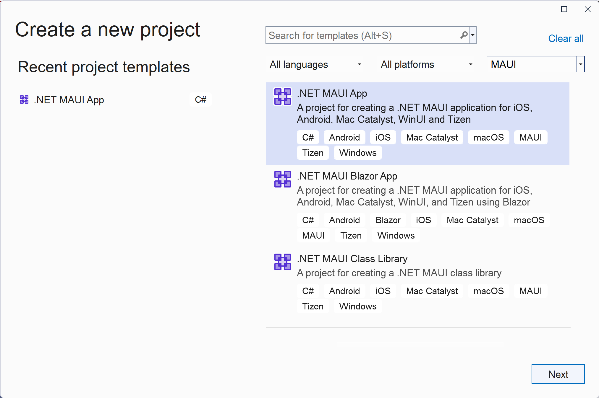
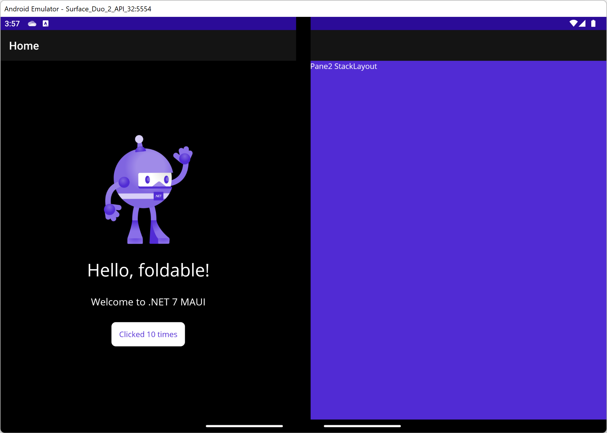

# .NET MAUI Foldable NuGet test app

This repo demonstrates how to add the `Microsoft.Maui.Controls.Foldable` NuGet to a blank/new **.NET MAUI** project/solution.

> **NOTE**
> This sample requires the `Microsoft.Maui.Controls.Foldable.nupkg` be available via a local feed - it is not yet available on nuget.org (15 September 2022).

## Steps to fold

1. In _Visual Studio 2022_ create a **File > New Project... > .NET MAUI App**

    

1. Right-click on the project and choose **Manage NuGet packages...**

1. Search for and install **Microsoft.Maui.Controls.Foldable**

1. In **MauiProgram.cs** add the foldable namespace and then `UseFoldable()` to the app builder object:

   ```csharp
   using Microsoft.Maui.Foldable;
   
   ...

   // Adapt to dual-screen and foldable Android devices like Surface Duo, includes TwoPaneView layout control
   builder.UseFoldable();
   ```

1. Add the following to **MainPage.xaml**

    In the `ContentPage` element:

    ```xaml
    xmlns:foldable="clr-namespace:Microsoft.Maui.Controls.Foldable;assembly=Microsoft.Maui.Controls.Foldable"
    ```

    Before the existing `<ScrollView>` default content:

    ```xaml
    <foldable:TwoPaneView x:Name="twoPaneView">
        <foldable:TwoPaneView.Pane1
            BackgroundColor="#dddddd">
    ```

    After the `<ScrollView>`:

    ```xaml
        </foldable:TwoPaneView.Pane1>
        <foldable:TwoPaneView.Pane2>
            <StackLayout BackgroundColor="{AppThemeBinding Light={StaticResource Secondary}, Dark={StaticResource Primary}}">
                <Label Text="Pane 2 StackLayout"/>
            </StackLayout>
        </foldable:TwoPaneView.Pane2>
    </foldable:TwoPaneView>
    ```

1. Run the app using the Surface Duo emulator and span it across both screens:

    


## Resources

- [.NET MAUI docs](https://docs.microsoft.com/dotnet/maui)
- [Surface Duo developer docs](https://docs.microsoft.com/dual-screen)