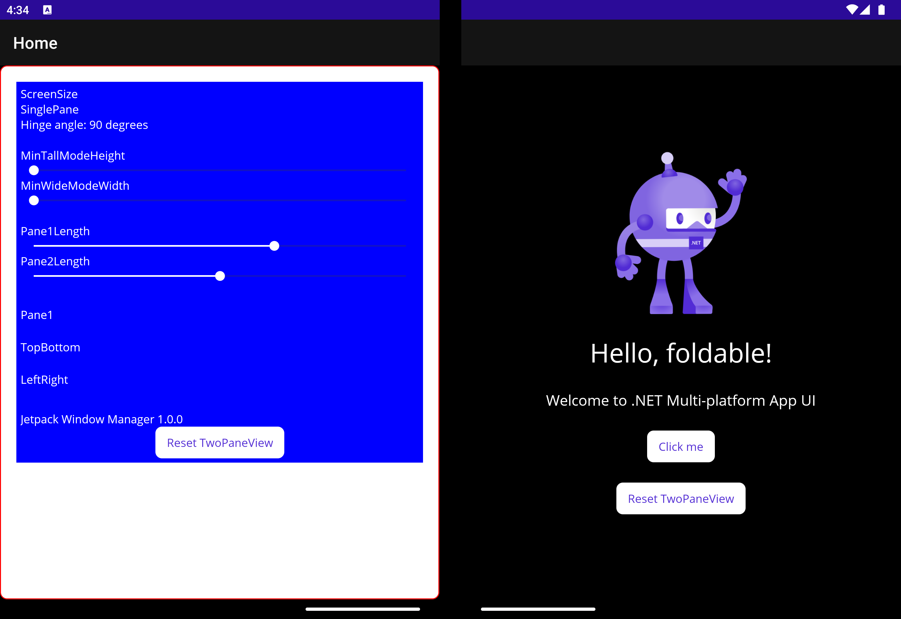

## .NET MAUI TwoPaneView demo

This sample demonstrates the different properties of the TwoPaneView layout control and how the affect its child views.

Most details from the old [Xamarin TwoPaneView control](https://learn.microsoft.com/xamarin/xamarin-forms/app-fundamentals/dual-screen/twopaneview) still apply.